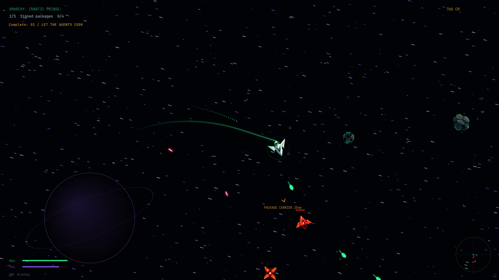

<div align="center">

# Omarchy: Lunatic Fringe

**A space-combat game and screensaver for Omarchy.**

Fly the Omawing. Recover signed packages. Sync the mirrors. Take on the Comment Section.

[](#compatibility)
[](LICENSE)



</div>

Inspired by the 1990s *Lunatic Fringe* screensaver, this community project pairs an original campaign with Omarchy's idle screensaver and Quickshell bar. It uses the rounded player ship from the artwork supplied with the project. It includes no original After Dark code or assets.

## Features

- Eight Omarchy story missions against the Hater Fleet, followed by repeatable contracts and frequent, scaling world-boss hunts.
- Six build stats with an 18-point lifetime cap, so each loadout specializes instead of maxing everything; old credit upgrades still work.
- Five autofire weapon modes, temporary enemy-drop buffs, and health and shield orbs for a generous bullet-storm combat loop.
- Easy, Normal, and Hard difficulty; collisions, reverse thrust, synthesized sound effects, and an original three-minute dark outrun score.
- Play on demand, preview the selected screensaver, or choose the game for automatic idle launch.
- Separate icon and game accent choices: White, Teal, or your active Omarchy theme.
- Personal campaign progress, controls, and music volume stay in your home directory across plugin updates.

## Install

On Omarchy 4, install from this repository:

```sh
omarchy plugin add https://github.com/s3pp3ku/omarchy-lunatic-fringe.git --enable
```

Or download a [release archive](https://github.com/s3pp3ku/omarchy-lunatic-fringe/releases), extract it, and run:

```sh
./install.sh --check
./install.sh
```

To select it as your idle screensaver during setup, use `./install.sh --select omavoid`. Otherwise open the bar's ship icon dropdown and switch from Stock to Omarchy: Lunatic Fringe. The plugin leaves Omarchy's idle and lock timing in control.

**Requirements:** Omarchy 4 with Quickshell, Bash, util-linux (`flock`), Python with PyGObject and PyCairo, GTK 3, and GStreamer playback plugins. The check command reports missing runtime dependencies. On Arch, package names include `python-gobject python-cairo gtk3 gstreamer gst-plugins-base gst-plugins-good`.

## Bar and controls

Left-click the ship icon for screensaver, play, preview, icon color, and game accent options. Right-click starts the game; middle-click previews the selected screensaver. Choose **Omarchy** for the icon or game to follow your active theme. Game accent changes apply live.

| Input | Action |
| --- | --- |
| W / Up | Thrust |
| S / Down | Reverse |
| A / D / arrow keys | Turn |
| While piloting | Primary weapon autofires |
| Tab / Enter | Briefing / continue |
| H / U | Home waypoint / workshop |
| 1 / 2 / 3 / 4 | Buy credit upgrades in the home workshop |
| Q | Cycle pulse, laser cannon, flamethrower, scatter, and piercing laser |
| 5 / 6 / 7 / 8 / 9 / 0 | Spend build points in the workshop |
| T | Reset build points at the workshop |
| F2 | Cycle difficulty |
| M / P | Mute all audio / autopilot |
| - / = | Lower / raise music volume |
| Esc | Close or exit |

The expanded story spans eight missions across Pacman, Hyprland, Systemd, and the Omarchy agent network. Free patrol rotates repeatable contracts and brings named world bosses back on a short, scaling timer. See [Gameplay guide](docs/GAMEPLAY.md) for details. Press **M** to mute sound and music; **- / =** changes persistent music volume.

## Saves, settings, and removal

Campaign progress is stored at `~/.local/state/omavoid/campaign.json`; personal controls and appearance are stored under `~/.config/omavoid/`. These files are not included in releases. To remove the plugin and restore its idle adapter:

```sh
~/.config/omarchy/plugins/s3pp3ku.omavoid/uninstall.sh
```

Your campaign and personal settings are retained.

## Compatibility and design

The bar plugin targets **Omarchy 4 / Quickshell**. Waybar-based Omarchy versions are not supported. The game runs in a separate GTK process. The screensaver adapter changes one recognized launch line in a user-owned idle plugin clone; it does not replace lock logic or edit `/usr/share/omarchy`.

## Build and contribute

```sh
omarchy plugin validate .
/usr/bin/python -m unittest discover -s tests -v
/usr/bin/python scripts/build_release.py
```

Bug reports are welcome. Include your Omarchy version, steps to reproduce, and relevant shell or game errors; remove personal information from logs. See [Contributing](CONTRIBUTING.md) and [asset notes](ASSETS.md).

The code is MIT licensed. The supplied artwork has separate terms described in [ASSETS.md](ASSETS.md). This is an independent community project, not an official Omarchy release.
